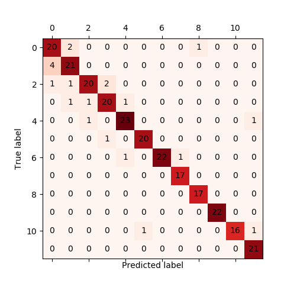

# 环境配置

- python3.7

- pytorch1.8及对应的torchvision和显卡对应的cudatoolkit

- detectron2(windows好像要自己编译不能用pip install)

- pytorchvideo

- fvcore

- python-opencv和对应版本的python-contrib-opencv

- opencv-python

- 其他见INSTALL.md

# 测试数据

## 摄像头

```
pythton mytools/jinyang/camera.py --cfg ../configs/SSv2/SLOWFAST_16x8_R50_test.yaml
```

## 单视频测试

- `test_imgs`用于存放测试的视频数据

- `checkpoint`用于存放预训练模型参数文件

- 需要先修改`mytools/jinyang/mytest.py`的img_path指向视频抽帧的文件

- 需要修改`configs/SSv2/SLOWFAST_16x8_R50_test.yaml`中的`TEST.CHECKPOINT_FILE_PATH`为指定的预模型参数文件

```
python mytools/jinyang/mytest.py --cfg configs/SSv2/SLOWFAST_16x8_R50_test.yaml
```

## 多视频测试

结合dataloader使用，需要先[准备数据](#训练数据准备)

```
python run_net.py --cfg configs/SSv2/SLOWFAST_16x8_R50_test.yaml
```

## 绘制混淆矩阵

结合dataloader使用，需要先[准备数据](#训练数据准备)

```
python mytools/jinyang/confusion_matrix.py --cfg configs/SSv2/SLOWFAST_16x8_R50_test.yaml
```




# 训练数据准备
## 数据文件目录结构

原来(甲方)的数据集文件目录结构

```
- dataset
    - video    (存放不同模态)
        - IR_raw    (存放不同类别)
            - 1    (存放不同视频)
                - 1-1.avi  
                - 1-2.avi
                - ...
            - 2
            - ...
        - RGB_raw 
```

处理后的文件目录结构

```
- dataset   (存放不同媒体)
    - video     (存放不同数据集)
        - train     (存放不同模态)
            - IR    (存放不同类别)
                - 1     (存放不同视频)
                    - 100001.avi
                    - 100002.avi
                    - ...
                - 2
                - ...
            - RGB
        - val
    - image     (存放不同数据集)
        - train     (存放不同模态)
            - IR    (存放不同类别)
                - 1     (存放不同视频)
                    - 100001    (存放不同帧)
                        - img_00001.jpg
                        - img_00002.jpg
                    - ...
                - 2
                - ...
            - RGB
        - val
```
## 视频数据重命名

将乱序的视频进行重命名，方便在linux系统上排序查看。

运行`mytools/jinyang/rename.py`，实现的功能是将source_path的视频重命名并存放在target_path中:

```
source_path/1/1-1.avi => target_path/1/100001.avi
source_path/1/1-2.avi => target_path/1/100002.avi
...
source_path/12/12-100.avi => target_path/12/120100.avi
```
## 视频的水平翻转

运行`mytools/jinyang/vflip.py`，实现的功能是将source_path的视频进行翻转，并存放在target_path中：

- `label`指定类别

- `vflip`指定是否翻转

```
source_path/1/100001.avi => target_path/1/100001.mp4
source_path/1/100002.avi => target_path/1/100002.mp4
...
source_path/12/120100.avi => target_path/12/120100.mp4
```

默认保存为`mp4`，如果保存格式为`avi`，则`ffmpeg`命令为：

```
ffmpeg -i [input].avi -vf "hflip" -c:v libx264 -crf 18 -y [output].avi
```

## 视频数据训练集和验证集的划分

运行`mytools/jinyang/dataset_partition.py`，实现的功能是将source_path目录下所有视频根据不同类别数据划分train和val数据集拷贝到新的目录

- `group`表示总共划分的组数，`group=4`表示训练集：测试集=3:1

- `data_type`表示模态，data_type="IR"表示红外，data_type="RGB"表示可将

- `label`指定类别数量

例如：

```
# for train set
source_path/1/100001.mp4 => train/1/100001.mp4
source_path/1/100002.mp4 => train/1/100002.mp4
source_path/1/100003.mp4 => train/1/100003.mp4

# for val set
source_path/1/100004.mp4 => val/1/100004.mp4
```

## 计算数据集的统计值

包括均值和方差，用来加速训练

```
python mytools/jinyang/calc_statistics.py
```


## 视频抽帧生成图片数据

视频抽帧和生成注解的命令

```
python mytools/jinyang/prepare_dataset.py
```

`mytools/jinyang/prepare_dataset.py`脚本分别执行了视频抽帧和生成注解两个脚本

### 视频抽帧

```
python mytools/jinyang/vid2img.py [source_path] [target_path]
```

source_path要求的和生成的target_path的文件目录结构如下：

```
- source_path
    - 1
        - 100001.mp4
        - 100002.mp4
        - ...
    - 2
    - ...
- target_path
    - 1
        - 100001
            - img_00001.jpg
            - img_00002.jpg
            - ...
        - 100002
        - ...
    - 2
    - ...
```

### 生成注解

生成三个文件主要是

```
python mytools/jinyang/generate_annotation.py --video_type [IR/RGB]
```
生成`train.csv`、`test.csv`、`val.csv`和`something-something-v2-labels.json`，其中`.csv`文件结构如下（只占第一列）：

```
original_vido_id video_id frame_id path labels
010001 1051 0 /data/lifengjun/gesture_dataset/dataset/image/RGB/test/1/010001/img_00001.jpg 1
010001 1051 1 /data/lifengjun/gesture_dataset/dataset/image/RGB/test/1/010001/img_00002.jpg 1
010001 1051 2 /data/lifengjun/gesture_dataset/dataset/image/RGB/test/1/010001/img_00003.jpg 1
```

生成的`.json`文件为，标注了每个类的定义和编号：
```
{
  "Make two waves with palms up": "1",
  "Make two waves with palms down": "2",
  "Point one finger up at the ceiling and rotate clockwise": "3",
  "Point one hand up to the ceiling and rotate counterclockwise": "4",
  "OK gesture": "5",
  "Point thumb 15 degrees vertically to the left": "6",
  "Point thumb 15 degrees vertically to the up": "7",
  "Point thumb 15 degrees vertically to the right": "8",
  "Point thumb 15 degrees vertically to the down": "9",
  "Cross two index fingers facing the camera": "10",
  "Waving to the left": "11",
  "Waving to the right": "12"
}
```

# ONNX

安装

```
pip install onnx onnxruntime onnxruntime-gpu onnx-simplifier
```

## 生成onnx

```
python mytools/jinyang/generate_onnx.py
```

## 使用onnx

```
python mytools/jinyang/mytest_onnx.py
```

# tensorrt

**安装**

- windows需要到官网下载cuDNN对应版本的tensorrt，然后把`bin`，`lib`，`include`目录合并拷贝到`C:\Program Files\NVIDIA GPU Computing Toolkit\CUDA\v11.4`中，需要把安装包下的对应python版本的tensorrt的.whl和相关包进行安装，对于tensorrt8.4建议安装pytorch1.11及以上版本 

- linux上通过以下命令安装

```
pip install nvidia-tensorrt -U --index-url https://pypi.ngc.nvidia.com```
```

## 生成tensorrt

```
python mytools/jinyang/generate_engine.py
```

## 使用tensorrt

有个坑需要先`import tensorrt`，然后再`import torch`，否则存在问题

```
python mytools/jinyang/mytest_engine.py
```

# 打包成.whl

```
python mytools/setup.py bdist_wheel
```

# ffmpeg相关命令

ffmpeg命令

- -i是输入文件名

- -qscale 0-255，越小质量越好

- -r 代表帧率，

mp4是30帧/秒

avi是29.98帧/秒

- -f 代表输出格式

- -ss: **开始时间** (**-ss HH:MM:SS**), **持续秒数** (**-t duration**), **结束时间** (**-to HH:MM:SS**), 和**开始秒数** (**-s duration**)的用法.

- 命名用一个image-%3d.png参数可以自动命名

- -s 指定分辨率

- -vf 设置视频过滤器，-1:300 高度固定300，宽度自适应

  ​	相同效用

```
  ffmpeg -i input.mpg -s 320x240 output.mp4 
  ffmpeg -i input.mpg -vf scale=320:240 output.mp4
  ```

- -q:v表示存储jpeg的图像质量，一般2是高质量。

- -thread 使用的线程数

视频裁剪命令

​```bash
ffmpeg -i input.mp4 -ss 00:01:00 -to 00:02:00 -c copy output.mp4
  ```

- -c:v 表示视频，-c:v copy表示拷贝原视频，libx264
- -f：指定使用avfoundation采集数据
- -vcodec libx264设置编码格式

视频翻转

```bash
ffmpeg -i 030001.avi -vf "hflip" -c:v libx264 -crf 18 -y output.mp4
```

-y 覆盖输出文件，不需要提示

-crf 在优先保证画面质量（也不太在乎转码时间）的情况下，使用-crf参数来控制转码是比较适宜的。这个参数的取值范围为0\~51，其中0为无损模式，数值越大，画质越差，生成的文件却越小。从主观上讲，18\~28是一个合理的范围。18被认为是视觉无损的（从技术角度上看当然还是有损的），它的输出视频质量和输入视频相当。
